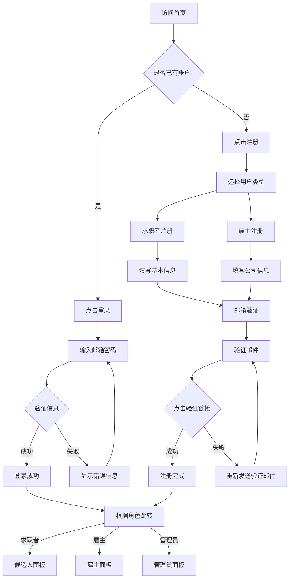
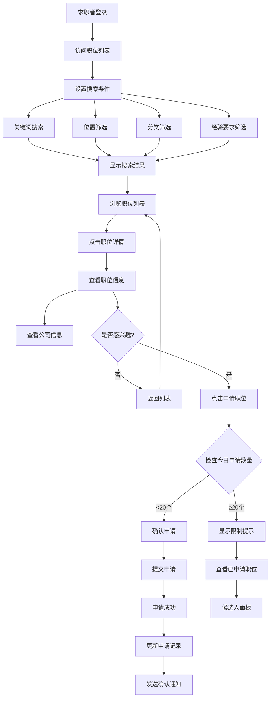
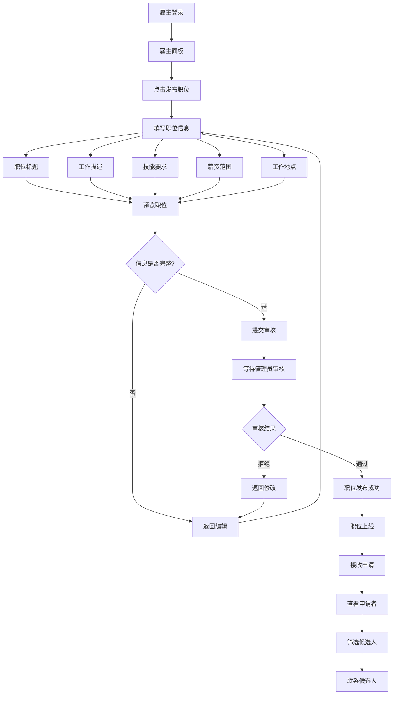
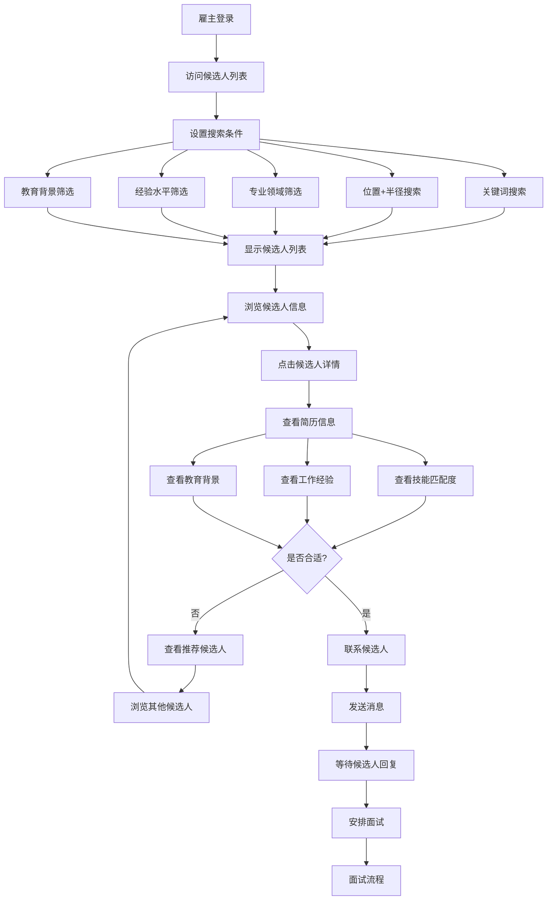
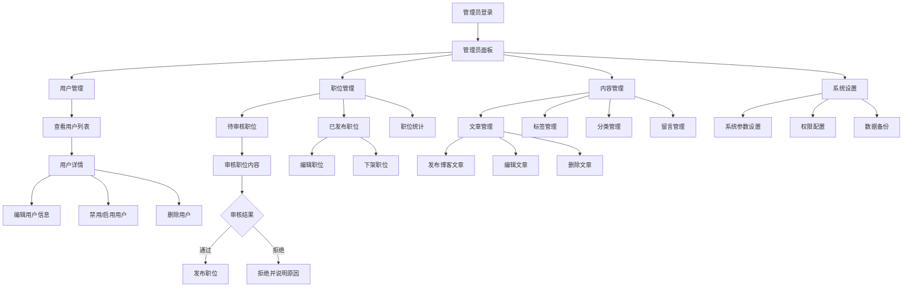
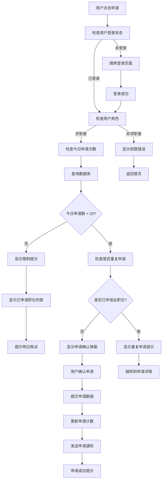
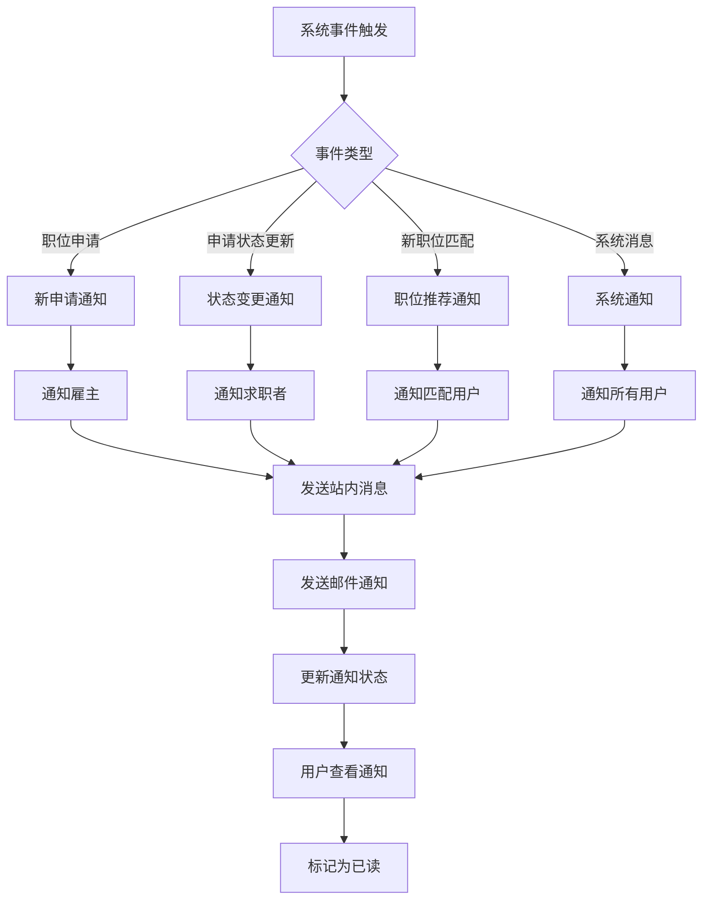

# Flexes 远程工程招聘平台 - 用户流程图设计

## 📋 概述

本文档基于需求文档设计了Flexes平台的核心用户交互流程图，涵盖求职者、雇主和管理员三种用户角色的主要使用场景。

---

## 🎯 核心用户角色

- **求职者 (Candidate)**: 寻找工作机会的用户
- **雇主 (Employer)**: 发布职位、寻找人才的企业用户
- **管理员 (Admin)**: 平台管理和维护人员

---

## 📊 流程图设计

### 1. 用户注册登录流程



### 2. 求职者职位搜索与申请流程



### 3. 雇主发布职位与管理流程


### 4. 雇主搜索候选人流程



### 5. 管理员平台管理流程



### 6. 职位申请限制控制流程




### 7. 消息通知流程



---

## 🎯 关键业务规则

### 职位申请限制
- **每日限制**: 求职者每天最多申请20个职位
- **重复检查**: 不允许重复申请同一职位
- **角色验证**: 只有求职者角色可以申请职位

### 用户权限控制
- **求职者**: 可以搜索职位、申请职位、管理个人资料
- **雇主**: 可以发布职位、搜索候选人、管理公司信息
- **管理员**: 拥有所有权限，负责审核和系统管理

### 搜索功能规则
- **位置搜索**: 支持设置搜索半径（10km, 25km, 50km, 100km, 不限）
- **多条件筛选**: 支持关键词、位置、经验、教育背景等多维度筛选
- **实时搜索**: 搜索条件变更时实时更新结果

---

## 📱 用户体验要点

### 1. 响应式设计
- 所有流程都需要适配移动端和桌面端
- 关键操作提供明确的视觉反馈

### 2. 错误处理
- 每个关键节点都有错误处理机制
- 提供清晰的错误提示和解决方案

### 3. 加载状态
- 数据加载时显示loading状态
- 长时间操作提供进度指示

### 4. 用户引导
- 新用户注册后提供功能引导
- 关键功能提供帮助提示

---

## 🔄 流程优化建议

### 1. 简化注册流程
- 减少必填字段，提高注册转化率
- 支持第三方登录（Google, LinkedIn等）

### 2. 智能推荐
- 基于用户行为推荐相关职位/候选人
- 机器学习优化匹配算法

### 3. 实时通信
- 集成即时聊天功能
- 支持视频面试预约

### 4. 数据分析
- 用户行为追踪和分析
- A/B测试优化转化率

---

## 📊 流程图使用说明

1. **Mermaid语法**: 所有流程图使用Mermaid语法编写，可直接在支持的平台渲染
2. **颜色说明**:
   - 绿色节点：成功状态
   - 红色节点：错误/失败状态
   - 蓝色节点：决策点
   - 灰色节点：普通流程节点
3. **更新维护**: 随着需求变更及时更新流程图，保持文档同步

---

**文档版本**: v1.0
**创建日期**: 2025-09-17
**最后更新**: 2025-09-17
**维护人员**: Augment Agent
```

    B --> W[管理已发布职位]
    W --> X[编辑职位]
    W --> Y[关闭职位]
    W --> Z[查看申请统计]
```