# Flexes 平台数据库 ER 图

## 📊 数据库实体关系图

本文档展示了 Flexes 远程工程招聘平台的完整数据库实体关系图，包括所有表结构、字段定义和关系映射。

## 🎯 核心实体概览

### 主要实体分类
- **用户管理**: users, candidates, employers
- **职位管理**: jobs, job_categories, job_applications
- **消息通知**: messages, notifications
- **内容管理**: articles, tags, article_tags
- **用户行为**: user_favorites, job_alerts, reviews
- **系统管理**: system_configs, operation_logs, daily_application_limits

## 📈 完整 ER 图

```mermaid
erDiagram
    %% 用户相关实体
    users {
        BIGINT user_id PK "用户ID"
        VARCHAR email UK "邮箱地址"
        VARCHAR password "密码哈希"
        TINYINT role "用户角色: 0-管理员, 1-求职者, 2-雇主"
        TINYINT status "账户状态: 0-禁用, 1-正常, 2-待验证"
        BOOLEAN email_verified "邮箱是否已验证"
        TIMESTAMP last_login_at "最后登录时间"
        TIMESTAMP created_at "创建时间"
        TIMESTAMP updated_at "更新时间"
    }

    candidates {
        BIGINT candidate_id PK "求职者ID"
        BIGINT user_id FK "关联用户ID"
        VARCHAR name "姓名"
        VARCHAR phone "手机号"
        VARCHAR avatar_url "头像URL"
        VARCHAR location "所在地"
        VARCHAR current_position "当前职位"
        TINYINT experience_years "工作经验年数"
        TINYINT education_level "教育水平"
        INT expected_salary_min "期望薪资最低值"
        INT expected_salary_max "期望薪资最高值"
        TINYINT job_status "求职状态"
        VARCHAR resume_url "简历文件URL"
        TEXT bio "个人简介"
        JSON skills "技能标签JSON"
        TIMESTAMP created_at "创建时间"
        TIMESTAMP updated_at "更新时间"
    }

    employers {
        BIGINT employer_id PK "雇主ID"
        BIGINT user_id FK "关联用户ID"
        VARCHAR company_name "公司名称"
        VARCHAR company_logo "公司Logo URL"
        VARCHAR industry "所属行业"
        TINYINT company_size "公司规模"
        YEAR founded_year "成立年份"
        VARCHAR website "公司官网"
        VARCHAR location "公司地址"
        TEXT description "公司简介"
        VARCHAR contact_person "联系人姓名"
        VARCHAR contact_phone "联系电话"
        BOOLEAN verified "是否已认证"
        TIMESTAMP created_at "创建时间"
        TIMESTAMP updated_at "更新时间"
    }

    %% 职位相关实体
    job_categories {
        INT category_id PK "分类ID"
        VARCHAR name "分类名称"
        VARCHAR slug UK "分类标识"
        TEXT description "分类描述"
        INT sort_order "排序权重"
        TINYINT status "状态"
        TIMESTAMP created_at "创建时间"
    }

    jobs {
        BIGINT job_id PK "职位ID"
        BIGINT employer_id FK "发布雇主ID"
        INT category_id FK "职位分类ID"
        VARCHAR title "职位标题"
        TEXT description "职位描述"
        TEXT requirements "职位要求"
        TEXT responsibilities "工作职责"
        JSON skills_required "必需技能JSON"
        JSON skills_preferred "优先技能JSON"
        TINYINT employment_type "工作类型"
        TINYINT experience_level "经验要求"
        TINYINT education_level "学历要求"
        INT salary_min "薪资最低值"
        INT salary_max "薪资最高值"
        VARCHAR salary_currency "薪资币种"
        VARCHAR location "工作地点"
        TINYINT remote_type "远程类型"
        TEXT benefits "福利待遇"
        DATE application_deadline "申请截止日期"
        TINYINT status "职位状态"
        INT view_count "浏览次数"
        INT application_count "申请次数"
        BOOLEAN featured "是否精选职位"
        TIMESTAMP created_at "创建时间"
        TIMESTAMP updated_at "更新时间"
    }

    job_applications {
        BIGINT application_id PK "申请ID"
        BIGINT job_id FK "职位ID"
        BIGINT candidate_id FK "求职者ID"
        TEXT cover_letter "求职信"
        VARCHAR resume_url "简历URL"
        TINYINT status "申请状态"
        TEXT employer_notes "雇主备注"
        TIMESTAMP applied_at "申请时间"
        TIMESTAMP updated_at "更新时间"
    }

    daily_application_limits {
        BIGINT limit_id PK "记录ID"
        BIGINT candidate_id FK "求职者ID"
        DATE application_date "申请日期"
        INT application_count "当日申请次数"
        TIMESTAMP created_at "创建时间"
        TIMESTAMP updated_at "更新时间"
    }

    %% 消息通知实体
    messages {
        BIGINT message_id PK "消息ID"
        BIGINT sender_id FK "发送者用户ID"
        BIGINT receiver_id FK "接收者用户ID"
        TINYINT message_type "消息类型"
        VARCHAR subject "消息主题"
        TEXT content "消息内容"
        BOOLEAN read_status "是否已读"
        TIMESTAMP read_at "阅读时间"
        TIMESTAMP created_at "创建时间"
    }

    notifications {
        BIGINT notification_id PK "通知ID"
        BIGINT user_id FK "用户ID"
        VARCHAR type "通知类型"
        VARCHAR title "通知标题"
        TEXT content "通知内容"
        JSON data "相关数据JSON"
        BOOLEAN read_status "是否已读"
        TIMESTAMP read_at "阅读时间"
        TIMESTAMP created_at "创建时间"
    }

    %% 内容管理实体
    articles {
        BIGINT article_id PK "文章ID"
        BIGINT author_id FK "作者用户ID"
        VARCHAR title "文章标题"
        VARCHAR slug UK "文章标识"
        LONGTEXT content "文章内容"
        TEXT excerpt "文章摘要"
        VARCHAR featured_image "特色图片URL"
        TINYINT status "文章状态"
        INT view_count "浏览次数"
        TIMESTAMP published_at "发布时间"
        TIMESTAMP created_at "创建时间"
        TIMESTAMP updated_at "更新时间"
    }

    tags {
        INT tag_id PK "标签ID"
        VARCHAR name UK "标签名称"
        VARCHAR slug UK "标签标识"
        TINYINT type "标签类型"
        INT usage_count "使用次数"
        TIMESTAMP created_at "创建时间"
    }

    article_tags {
        BIGINT article_id FK "文章ID"
        INT tag_id FK "标签ID"
    }

    %% 用户行为实体
    user_favorites {
        BIGINT favorite_id PK "收藏ID"
        BIGINT user_id FK "用户ID"
        TINYINT target_type "收藏类型"
        BIGINT target_id "目标ID"
        TIMESTAMP created_at "创建时间"
    }

    job_alerts {
        BIGINT alert_id PK "提醒ID"
        BIGINT user_id FK "用户ID"
        VARCHAR name "提醒名称"
        VARCHAR keywords "关键词"
        VARCHAR location "地点"
        INT category_id FK "职位分类"
        TINYINT employment_type "工作类型"
        TINYINT experience_level "经验要求"
        INT salary_min "最低薪资"
        TINYINT frequency "提醒频率"
        TINYINT status "状态"
        TIMESTAMP last_sent_at "最后发送时间"
        TIMESTAMP created_at "创建时间"
        TIMESTAMP updated_at "更新时间"
    }

    reviews {
        BIGINT review_id PK "评价ID"
        BIGINT reviewer_id FK "评价者用户ID"
        TINYINT target_type "评价类型"
        BIGINT target_id "目标ID"
        TINYINT rating "评分"
        VARCHAR title "评价标题"
        TEXT content "评价内容"
        TINYINT status "审核状态"
        TIMESTAMP created_at "创建时间"
        TIMESTAMP updated_at "更新时间"
    }

    %% 系统管理实体
    system_configs {
        INT config_id PK "配置ID"
        VARCHAR config_key UK "配置键"
        TEXT config_value "配置值"
        VARCHAR description "配置描述"
        VARCHAR type "数据类型"
        TIMESTAMP created_at "创建时间"
        TIMESTAMP updated_at "更新时间"
    }

    operation_logs {
        BIGINT log_id PK "日志ID"
        BIGINT user_id FK "操作用户ID"
        VARCHAR action "操作动作"
        VARCHAR resource_type "资源类型"
        BIGINT resource_id "资源ID"
        VARCHAR ip_address "IP地址"
        TEXT user_agent "用户代理"
        JSON details "操作详情JSON"
        TIMESTAMP created_at "创建时间"
    }

    %% 关系定义
    users ||--o{ candidates : "一对一"
    users ||--o{ employers : "一对一"
    users ||--o{ messages : "发送消息"
    users ||--o{ messages : "接收消息"
    users ||--o{ notifications : "接收通知"
    users ||--o{ articles : "创作文章"
    users ||--o{ user_favorites : "用户收藏"
    users ||--o{ job_alerts : "职位提醒"
    users ||--o{ reviews : "用户评价"
    users ||--o{ operation_logs : "操作日志"

    employers ||--o{ jobs : "发布职位"
    job_categories ||--o{ jobs : "职位分类"
    job_categories ||--o{ job_alerts : "提醒分类"

    jobs ||--o{ job_applications : "职位申请"
    candidates ||--o{ job_applications : "求职者申请"
    candidates ||--o{ daily_application_limits : "申请限制"

    articles ||--o{ article_tags : "文章标签"
    tags ||--o{ article_tags : "标签文章"
```

## 🔗 关系详细说明

### 核心关系映射

#### 1. 用户体系关系
- **users → candidates**: 一对一关系，求职者用户扩展信息
- **users → employers**: 一对一关系，雇主用户扩展信息
- **users → operation_logs**: 一对多关系，用户操作日志记录

#### 2. 职位申请流程
- **employers → jobs**: 一对多关系，雇主发布多个职位
- **job_categories → jobs**: 一对多关系，分类包含多个职位
- **jobs → job_applications**: 一对多关系，职位收到多个申请
- **candidates → job_applications**: 一对多关系，求职者提交多个申请
- **candidates → daily_application_limits**: 一对多关系，每日申请限制记录

#### 3. 消息通信系统
- **users → messages (sender)**: 一对多关系，用户发送消息
- **users → messages (receiver)**: 一对多关系，用户接收消息
- **users → notifications**: 一对多关系，用户接收系统通知

#### 4. 内容管理系统
- **users → articles**: 一对多关系，用户创作文章
- **articles → article_tags**: 多对多关系，文章与标签关联
- **tags → article_tags**: 多对多关系，标签与文章关联

#### 5. 用户行为追踪
- **users → user_favorites**: 一对多关系，用户收藏记录
- **users → job_alerts**: 一对多关系，用户职位提醒设置
- **users → reviews**: 一对多关系，用户评价记录
- **job_categories → job_alerts**: 一对多关系，分类相关的职位提醒

## 📋 字段类型说明

### 枚举值定义

#### 用户角色 (users.role)
- `0`: 管理员
- `1`: 求职者
- `2`: 雇主

#### 账户状态 (users.status)
- `0`: 禁用
- `1`: 正常
- `2`: 待验证

#### 教育水平 (candidates.education_level)
- `1`: 高中
- `2`: 专科
- `3`: 本科
- `4`: 硕士
- `5`: 博士

#### 求职状态 (candidates.job_status)
- `0`: 不找工作
- `1`: 看机会
- `2`: 急找工作

#### 公司规模 (employers.company_size)
- `1`: 1-10人
- `2`: 11-50人
- `3`: 51-200人
- `4`: 201-1000人
- `5`: 1000+人

#### 工作类型 (jobs.employment_type)
- `1`: 全职
- `2`: 兼职
- `3`: 合同工
- `4`: 实习

#### 经验要求 (jobs.experience_level)
- `1`: 应届生
- `2`: 初级
- `3`: 中级
- `4`: 高级
- `5`: 专家

#### 远程类型 (jobs.remote_type)
- `1`: 完全远程
- `2`: 混合办公
- `3`: 现场办公

#### 职位状态 (jobs.status)
- `0`: 待审核
- `1`: 招聘中
- `2`: 暂停
- `3`: 已关闭

#### 申请状态 (job_applications.status)
- `1`: 已提交
- `2`: 已查看
- `3`: 面试中
- `4`: 已拒绝
- `5`: 已录用

#### 消息类型 (messages.message_type)
- `1`: 普通消息
- `2`: 面试邀请
- `3`: 工作邀请
- `4`: 系统通知

#### 标签类型 (tags.type)
- `1`: 技能标签
- `2`: 行业标签
- `3`: 文章标签

#### 收藏类型 (user_favorites.target_type)
- `1`: 职位
- `2`: 候选人
- `3`: 公司

#### 提醒频率 (job_alerts.frequency)
- `1`: 实时
- `2`: 每日
- `3`: 每周

#### 评价类型 (reviews.target_type)
- `1`: 平台评价
- `2`: 公司评价

## 🔍 索引策略

### 主要索引设计

#### 性能优化索引
- **用户查询**: `idx_users_role_status_login` (role, status, last_login_at)
- **职位搜索**: `idx_jobs_search` (status, location, employment_type, experience_level)
- **候选人搜索**: `idx_candidates_search` (job_status, location, experience_years, education_level)
- **消息查询**: `idx_messages_receiver_read` (receiver_id, read_status, created_at)

#### 全文搜索索引
- **职位搜索**: `idx_title_description` (title, description)
- **文章搜索**: `idx_title_content` (title, content)

#### 唯一约束索引
- **防重复申请**: `uk_job_candidate` (job_id, candidate_id)
- **每日限制**: `uk_candidate_date` (candidate_id, application_date)
- **用户收藏**: `uk_user_target` (user_id, target_type, target_id)

## 🛡️ 数据完整性约束

### 外键约束策略

#### CASCADE 删除
- 用户删除时，级联删除相关的候选人/雇主信息
- 职位删除时，级联删除相关申请记录
- 文章删除时，级联删除标签关联

#### SET NULL 策略
- 用户删除时，操作日志保留但用户ID设为NULL
- 分类删除时，职位的分类ID设为NULL

#### 业务规则约束
- 每个用户只能有一个候选人或雇主身份
- 求职者每天申请职位数量限制
- 同一职位不能重复申请

## 📊 数据统计视图

### 预定义视图

#### job_details_view
提供职位详细信息的综合视图，包含：
- 职位基本信息
- 公司信息
- 分类信息
- 雇主联系方式

#### candidate_details_view
提供求职者详细信息的综合视图，包含：
- 候选人基本信息
- 用户账户信息
- 技能和经验信息

## 🔧 存储过程

### 业务逻辑存储过程

#### CheckDailyApplicationLimit
检查求职者每日申请限制：
- 输入：候选人ID、申请日期
- 输出：当前申请次数、是否可以申请

#### UpdateDailyApplicationCount
更新每日申请计数：
- 自动维护申请限制记录
- 支持并发安全更新

## ⚡ 触发器机制

### 自动化业务逻辑

#### after_user_insert
用户注册后自动创建角色信息：
- 求职者用户：自动创建candidates记录
- 雇主用户：自动创建employers记录

#### after_job_application_insert
职位申请后自动更新统计：
- 更新职位申请计数
- 更新每日申请限制计数

## 📈 扩展性设计

### 水平扩展考虑
- 用户表按用户ID分片
- 职位表按地区或时间分片
- 消息表按时间分区

### 垂直扩展优化
- 大文本字段独立存储
- 文件URL外部存储
- 搜索索引独立服务

---

*本ER图基于 Flexes v1.0 数据库设计，最后更新时间：2025-09-17*
